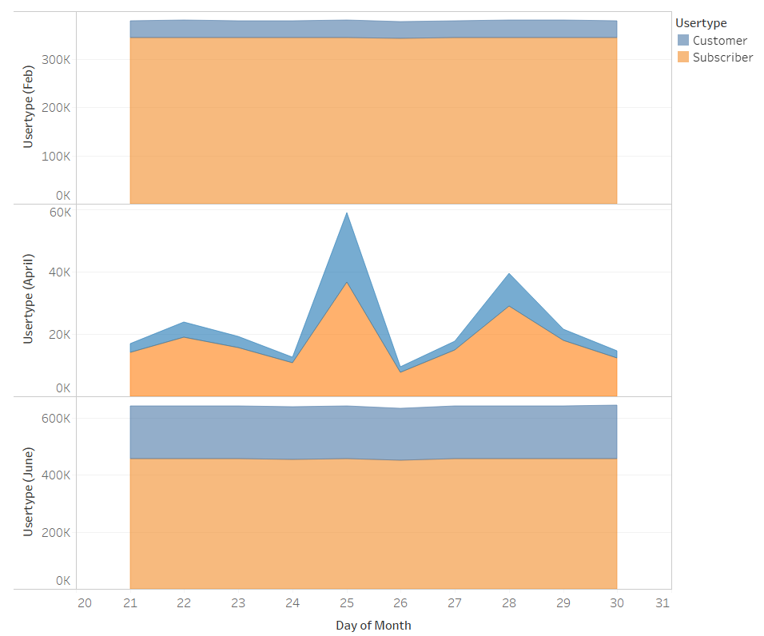

# Citi-Bikes-Tableau
With the country going back to work amidst the pandemic, risk of contracting the virus have also increased and hence people are preferring to ride a bike instead of using the Subways and Buses. This project creates an interactive dashboard using Tableau to visualize Citi Bikes Data which will identify busy stations, rush hours and find trends of usage that can help the customers to decide their time and route of travel and the management to put in right policies to meet the rising demand. 

## Narrative
A story has been created consisting of 7 dashboards each focusing on a particular feature from the dataset to uncover hidden trends and understand the market better. 

## Data
* The data was collected from [Citi Bike Data](https://www.citibikenyc.com/system-data)
* Original data consisted of 3 tables with 3.7 million rows in total and 15 columns. Due to huge quantity of data, it was skimmed down to 1.28 million rows for the last 10 days of each month and it was then cleaned
* A new aggregated dataframe was made to calculate rush hours for all the months    

## Tools and Technologies used
* Jupyter Notebook
* Python- Pandas
* Tableau

## How to run the code
* Download citi_bikes.twb file and open it in Tableau.

## Ouput and Observations 

1. **Total Rides Dashboard**

* The dashboard shows total rides per month comaprison as well as daily total comparison

* Due to the huge volume of data, it has been filtered to only dates after 20th of each month.

* Total Rides during the month of February 2020 were 1,146,830, during April 682,762 and in June 1,882,273. There has been a **64.55%** rise in total rides from February to June.

* It can be clearly noticed that people are preferring Citi Bikes in the pandemic to avoid crowded and risk prone Subways or Buses.

2. **Customer Demographic Dashboard**

* The Pie charts show total rides distribution amongst the genders. Number of female riders have grown drastically during the period.

* The histogram shows age demographics of the customers. Trend of Age distribution has been the same roughly, except that riders born between 1980-1990 have increased by huge numbers in the month of June.

3. **Customer Type**
* The Area chart shows Number of Customers (irregular riders) versus Subscribers (regular riders).

* During February, an underlying trend can be noticed throughout the month. Customers are 10% of the number of Subscribers

* In April, there isn't a very specific or standard trend in the ratio.

* In June, a fixed trend can be seen again but this time it is 40% customers of the subscriber population.

* It can be concluded that even though riders have grown drastically from February, the growth could be temporary as increase in regular riders (subscribers) is not very huge.  

4. **Popular End Station** 
* This chart displays each station with size and color representing number of Trips ending on the particular station. The Table on left shows total number of trips ending on the station from 21st to 30th June.

* This chart can be filtered for any number of particular stations by clicking on the checkbox on the right. As seen in second image below.

* To avoid rush stops, this can help users select a station with lesser crowd by filtering out the closest stations, and walking to the one with lesser count of rides.

* Like in the example below, first and fourth station have about 1400 rides ending, in just 10 days, but the next two had only about 200 rides. It is safer to avoid rush places. 

* Also, it can help to find a bike during rush days/hours as busy start stations might run out of bikes to rent or busy end stations might have more bikes to rent.

* Similarly, **Popular Start Station** can help users decide which station to start from. 

6. **Popular Hour of the Day and Average Trip Duration per Station**

* The line chart shows popular hours to start and end trips, surprisingly, the trend of the two are almost same. Popular hours being morning 8 to evening 7.

* The bar chart shows Average trip duration per station, sorted in descending order. This may help manage inventory better at the stations to meet demand. 

7. **Total Rides Trend for the Month**

* These charts show trend of demand during the month. Sometimes demand, like in the month April, can be so fluctuating, it is hard to understand their exact trend. Tableau can be used to draw a line that smoothens the inclination.

* It can be useful in forecastig demand for the coming months.

* It can be noticed that it was decreasing in February but increasing trend in both April and Februrary.

 
